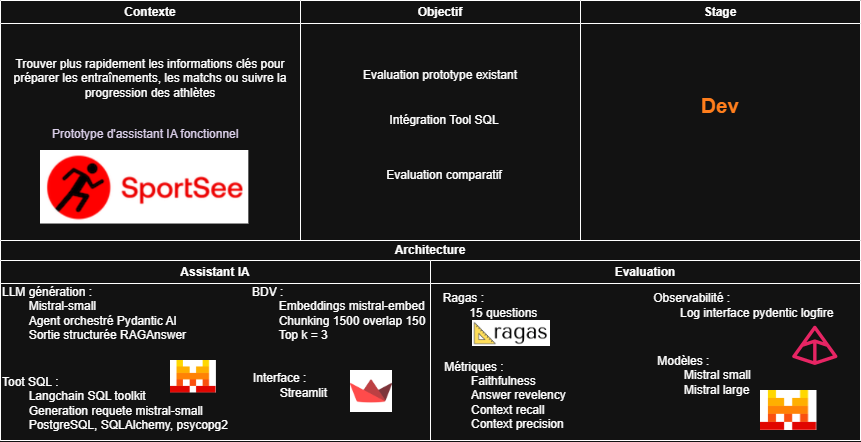
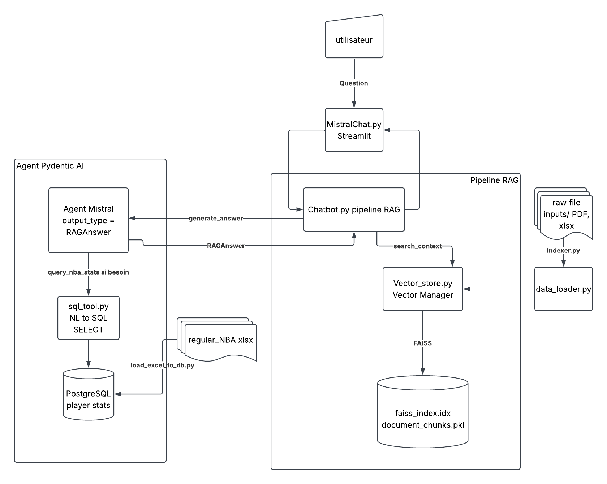

# NBA Analyst AI : Assistant RAG avec Mistral

Assistant virtuel destiné aux coachs et au staff technique d'une équipe NBA. Il combine
une recherche sémantique (RAG) sur une base documentaire (articles, retours d'expérience)
et un accès en langage naturel à une base de statistiques NBA (PostgreSQL), le tout
piloté par un agent [Pydantic AI](https://ai.pydantic.dev/) appuyé sur les modèles Mistral.

<p align="center">
  
</p>

## Fonctionnalités

- 🔍 **Recherche sémantique** avec FAISS sur une base documentaire (PDF, notes, etc.)
- 🧮 **Interrogation de statistiques NBA** en langage naturel via un outil NL→SQL (PostgreSQL)
- 🤖 **Génération de réponses structurées** avec les modèles Mistral, via un agent Pydantic AI
- 📊 **Évaluation continue de la qualité** du RAG avec RAGAS (faithfulness, context precision/recall, answer relevancy)
- 📈 **Observabilité** des appels LLM et du pipeline via Pydantic Logfire

> 📄 Les résultats d'évaluation RAGAS (scores par itération) et leur interprétation sont disponibles dans le [rapport d'évaluation](rapport_deval.ipynb).

## Architecture cible



Deux sources de vérité alimentent les réponses du chatbot :

1. **Base documentaire** (`inputs/` → `indexer.py` → index FAISS dans `vector_db/`) pour le
   contexte qualitatif (retours d'expérience, articles).
2. **Base PostgreSQL** (`inputs/regular_NBA.xlsx` → `Sql_db/load_excel_to_db.py` → tables
   `teams` / `player_stats`) pour les statistiques chiffrées, interrogée à la demande par
   l'agent via l'outil `query_nba_stats` (génération de SQL en lecture seule uniquement).

L'agent Pydantic AI (`utils/chatbot.py`) décide lui-même, question par question, s'il doit
s'appuyer sur le contexte documentaire, appeler l'outil SQL, ou les deux, puis renvoie une
réponse validée par le schéma `RAGAnswer`. Chaque étape (recherche, génération, requête SQL)
est tracée par Logfire, et le même pipeline (`ask_with_context`) est réutilisé par
l'évaluation RAGAS pour rester représentatif de ce que voit l'utilisateur final.

## Scripts et modules principaux

| Fichier | Rôle |
|---|---|
| `MistralChat.py` | Interface Streamlit : point d'entrée utilisateur, appelle le pipeline RAG et affiche la conversation. |
| `indexer.py` | Construit/reconstruit l'index FAISS à partir des documents de `inputs/` (CLI : `--input-dir`, `--data-url`). |
| `utils/chatbot.py` | Cœur du pipeline RAG : recherche de contexte, agent Pydantic AI (Mistral + outil SQL), génération de la réponse structurée. Utilisé à la fois par l'UI et par les scripts RAGAS. |
| `utils/vector_store.py` | `VectorStoreManager` : découpage des documents en chunks, génération des embeddings Mistral, création/chargement/recherche de l'index FAISS. |
| `utils/data_loader.py` | Extraction de texte (PDF avec fallback OCR, DOCX, TXT, CSV, XLSX) et nettoyage/validation des documents avant chunking. |
| `utils/schemas.py` | Modèles Pydantic du pipeline (`RawDocument` → `CleanedDocument` → `Chunk` → `EmbeddedChunk` → `SearchResult`, `RAGQuery`, `RAGAnswer`). |
| `utils/config.py` | Configuration centralisée (clés API, modèles Mistral, chemins, hyperparamètres LLM, URL PostgreSQL). |
| `utils/observability.py` | Configuration Pydantic Logfire (local par défaut, cloud si `LOGFIRE_TOKEN` est défini) et branchement du logging standard. |
| `Sql_db/load_excel_to_db.py` | Charge `inputs/regular_NBA.xlsx` dans PostgreSQL (tables `teams`, `player_stats`), en recréant les tables à chaque exécution. |
| `Sql_db/sql_tool.py` | Outil NL→SQL : génère une requête SQL (few-shot + schéma introspecté) à partir d'une question, la valide (SELECT uniquement, `LIMIT` forcé) puis l'exécute. |
| `ragas_part/ans_cont_recup_ragas.py` | Génère réponses et contextes pour chaque question de `ragas_part/ragas_dataset.json` en appelant le pipeline réel (`ask_with_context`). |
| `ragas_part/evaluate_ragas.py` | Évalue la qualité du RAG avec RAGAS sur le dataset généré et journalise les scores dans Logfire. |
| `tests/` | Tests unitaires (`tests/unit`), fonctionnels (`tests/functional`) et d'intégration (`tests/integration`, nécessitent des identifiants réels). |
| `rapport_deval.ipynb` | Rapport d'évaluation : évolution des scores RAGAS entre itérations, améliorations apportées au système et interprétation des résultats. |

## Installation et reproductibilité

### Prérequis

- Python 3.12+
- [uv](https://docs.astral.sh/uv/) pour la gestion des dépendances et de l'environnement
- Une clé API Mistral ([console.mistral.ai](https://console.mistral.ai/))
- Une base PostgreSQL accessible (locale ou distante) pour les fonctionnalités NBA/SQL
- (Optionnel) Un token [Logfire](https://logfire.pydantic.dev/) pour envoyer les traces vers le cloud

### 1. Cloner le dépôt

```bash
git clone https://github.com/leskimou/P10_system_rag_performances.git
cd P10_system_rag_performances
```

### 2. Installer les dépendances

Les dépendances sont figées dans `uv.lock` : `uv sync` reconstruit un environnement
strictement identique (mêmes versions) sur n'importe quelle machine.

```bash
make install
# équivalent à : uv sync
```

`uv run` active automatiquement le `.venv` créé ; l'activation manuelle est optionnelle.

### 3. Configurer les variables d'environnement

Créer un fichier `.env` à la racine (non versionné) avec :

```dotenv
# Obligatoire pour le RAG (embeddings + génération)
MISTRAL_API_KEY=votre_cle_api_mistral

# Obligatoire pour l'outil SQL NBA (Sql_db/*)
DB_HOST=localhost
DB_PORT=5432
DB_NAME=nba
DB_USER=postgres
DB_PWD=votre_mot_de_passe

# Optionnel : envoie les traces/logs vers Logfire cloud (sinon local uniquement)
LOGFIRE_TOKEN=
```

### 4. Reconstruire les bases de connaissances

Ces deux étapes régénèrent, à partir des seules données sources versionnées dans `inputs/`,
les artefacts nécessaires au fonctionnement de l'application :

```bash
make index      # construit vector_db/faiss_index.idx et document_chunks.pkl
make load-db    # charge inputs/regular_NBA.xlsx dans PostgreSQL (teams, player_stats)
```

### 5. Lancer l'application

```bash
make run
# équivalent à : uv run streamlit run MistralChat.py
```

L'application est accessible sur http://localhost:8501.

### 6. Vérifier la reproductibilité (tests + évaluation)

```bash
make test           # tests unitaires, fonctionnels et d'intégration (pytest)
make ragas-refresh   # reindexe, regenere le dataset RAGAS et relance l'evaluation
```

Les tests d'intégration (`tests/integration/`) nécessitent des identifiants réels
(`MISTRAL_API_KEY`, PostgreSQL) et sont skippés automatiquement s'ils sont absents.

### Commandes Makefile disponibles

```bash
make help
```

| Commande | Description |
|---|---|
| `make install` | Installe les dépendances via `uv sync` |
| `make run` | Lance l'application Streamlit |
| `make index` | Indexe les documents de `inputs/` dans FAISS |
| `make load-db` | Charge `regular_NBA.xlsx` dans PostgreSQL |
| `make ragas-dataset` | Régénère les réponses/contextes du dataset RAGAS |
| `make ragas-eval` | Évalue le pipeline RAG avec RAGAS |
| `make ragas-refresh` | Enchaîne `index` → `ragas-dataset` → `ragas-eval` |
| `make test` | Lance tous les tests (unitaires, fonctionnels, intégration) |
| `make clean` | Supprime les caches Python (`__pycache__`) |

## Documentation

### Pydantic & Pydantic AI dans le projet

Le pipeline RAG s'appuie sur l'écosystème Pydantic à chaque étape, du chargement des
documents jusqu'à la génération de la réponse :

- **Validation des données à chaque frontière du pipeline** (`utils/schemas.py`) : un modèle
  dédié par étape (`RawDocument` → `CleanedDocument` → `Chunk` → `EmbeddedChunk` →
  `SearchResult`) remplace les `dict` non typés qui circulaient auparavant entre
  `data_loader.py`, `vector_store.py` et `chatbot.py`. Chaque modèle impose ses propres
  contraintes (ex. `page_content` non vide via `Field(min_length=1)`), ce qui fait échouer
  tôt et explicitement un document mal formé plutôt que de propager une erreur silencieuse
  plus loin dans le pipeline.
- **Échecs gérés sans interrompre tout le pipeline** : `build_cleaned_document()`
  (`utils/data_loader.py`) capture les `ValidationError` pour ignorer et logguer un document
  invalide sans stopper l'indexation des autres documents.
- **Validation des entrées utilisateur** : `RAGQuery` (`utils/schemas.py`) valide et nettoie
  la question posée (longueur, non-vide) avant qu'elle ne soit envoyée au modèle, dans
  `generate_answer()` (`utils/chatbot.py`).
- **Sortie structurée du LLM avec Pydantic AI** : le chatbot utilise
  `pydantic_ai.Agent(MistralModel(...), output_type=RAGAnswer)` (`utils/chatbot.py`) pour
  forcer le modèle Mistral à renvoyer une réponse conforme au schéma `RAGAnswer`, plutôt
  qu'un texte libre à parser manuellement.

### Outil NL→SQL (statistiques NBA)

`Sql_db/sql_tool.py` expose l'outil `query_nba_stats` à l'agent (`_agent.tool_plain`) : il
génère une requête SQL à partir de la question (prompt few-shot + schéma PostgreSQL
introspecté via `langchain_community.SQLDatabase`), la restreint à un `SELECT` unique sans
mot-clé de modification (`is_safe_select`), force une limite de lignes (`enforce_row_limit`),
puis l'exécute. Toute erreur (SQL invalide, colonne inexistante, base injoignable) est
capturée et renvoyée comme message lisible plutôt que de lever une exception.

### Observabilité (Pydantic Logfire)

`utils/observability.py` configure Logfire une seule fois au chargement de `utils/config.py` :
local uniquement par défaut, envoi vers l'interface web Logfire si `LOGFIRE_TOKEN` est défini.
`logfire.instrument_pydantic_ai()` trace automatiquement les appels de l'agent ; des spans
explicites (`search_context`, `generate_answer`, `ask_with_context`, `indexing_pipeline`,
`ragas_evaluation_run`, ...) suivent chaque étape du pipeline RAG et de l'indexation. Un
handler `logfire.LogfireLoggingHandler()` est aussi attaché au logger racine, si bien que
tous les `logging.info/warning/error` déjà présents dans le code remontent automatiquement
dans Logfire sans modification supplémentaire.

### Évaluation RAGAS

Le dataset (`ragas_part/ragas_dataset.json`) contient des questions avec leur `ground_truth`
attendue. `make ragas-dataset` (`ragas_part/ans_cont_recup_ragas.py`) exécute le pipeline réel
(`ask_with_context`) pour chaque question et enregistre réponse + contextes récupérés
(vector store et/ou résultats SQL) dans le dataset. `make ragas-eval`
(`ragas_part/evaluate_ragas.py`) calcule ensuite quatre métriques avec un LLM juge
(`mistral-large-latest`) :

- **faithfulness** : la réponse est-elle fidèle aux contextes fournis ?
- **context precision** / **context recall** : les contextes récupérés sont-ils pertinents et suffisants ?
- **answer relevancy** : la réponse répond-elle bien à la question posée ?

Chaque métrique est comparée à un seuil (`SCORE_THRESHOLD = 0.7`) ; le résultat de chaque
run (moyennes, succès/échec, durée) est journalisé dans Logfire (`ragas_evaluation_run`) pour
suivre la qualité du RAG dans le temps.

**Résultats et interprétation** : l'évolution des scores RAGAS au fil des itérations, le détail
des améliorations apportées à chaque étape et l'interprétation des résultats (points forts,
points faibles, pistes d'amélioration) sont documentés dans
[`rapport_deval.ipynb`](rapport_deval.ipynb).

### Personnalisation

Les principaux paramètres sont centralisés dans `utils/config.py` :
- Modèles Mistral utilisés (génération, embeddings)
- Taille des chunks et chevauchement (`CHUNK_SIZE`, `CHUNK_OVERLAP`)
- Nombre de documents récupérés par défaut (`SEARCH_K`)
- Hyperparamètres LLM (`LLM_TEMPERATURE`, `LLM_TOP_P`, `LLM_MAX_TOKENS`)

### Ressources externes

- [Console Mistral AI](https://console.mistral.ai/) : gestion des clés API
- [Documentation uv](https://docs.astral.sh/uv/) : gestion des dépendances/environnement
- [Documentation Pydantic AI](https://ai.pydantic.dev/) : agents et sorties structurées
- [Documentation Logfire](https://logfire.pydantic.dev/docs/) : observabilité
- [Documentation RAGAS](https://docs.ragas.io/) : métriques d'évaluation RAG
